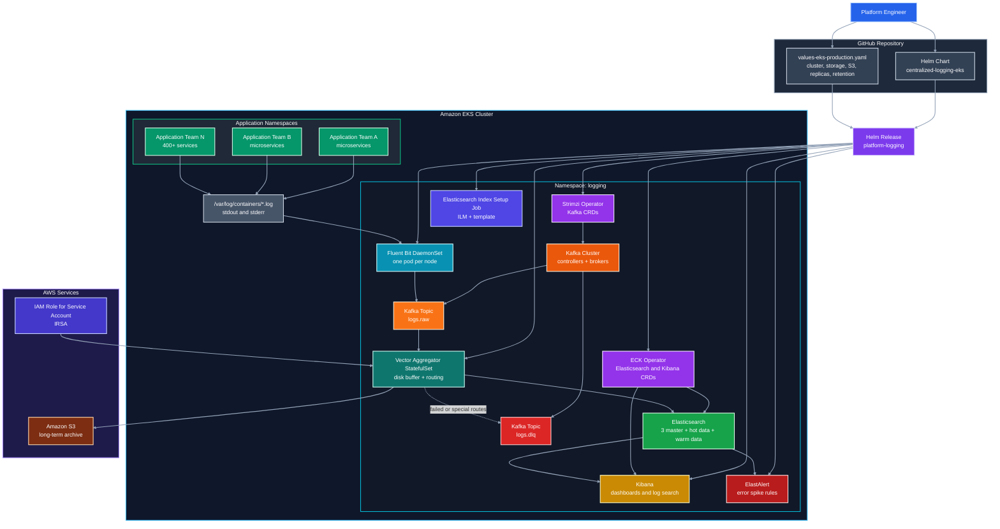
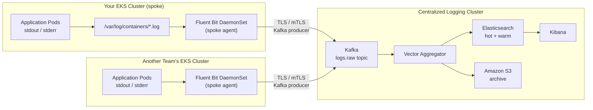

# Centralized Logging Platform for Amazon EKS

A production-ready, Helm-managed centralized logging stack for Amazon EKS.

This chart deploys the complete logging pipeline:

```text
Kubernetes Pods
  -> Fluent Bit DaemonSet
  -> Apache Kafka / Strimzi
  -> Vector Aggregator StatefulSet
  -> Elasticsearch hot + warm data tiers
  -> Amazon S3 archive
  -> Kibana dashboards
  -> ElastAlert alerts
```

Recommended Helm release name:

```bash
platform-logging
```

---

## Table of contents

- [Why this setup was chosen](#why-this-setup-was-chosen)
- [Problems with the previous approach](#problems-with-the-previous-approach)
- [Why the Helm-based solution is better](#why-the-helm-based-solution-is-better)
- [Architecture diagram](#architecture-diagram)
- [Component responsibilities](#component-responsibilities)
- [Repository and Helm chart structure](#repository-and-helm-chart-structure)
- [Prerequisites](#prerequisites)
- [Step-by-step Helm deployment guide](#step-by-step-helm-deployment-guide)
- [Recommended values to review before production](#recommended-values-to-review-before-production)
- [Verification](#verification)
- [Kibana access](#kibana-access)
- [Upgrade guide](#upgrade-guide)
- [Rollback guide](#rollback-guide)
- [Uninstall guide](#uninstall-guide)
- [Team onboarding guide](#team-onboarding-guide)
  - [How logs flow from your cluster to the centralized platform](#how-logs-flow-from-your-cluster-to-the-centralized-platform)
  - [Step 1: Register your cluster with the platform team](#step-1-register-your-cluster-with-the-platform-team)
  - [Step 2: Set up cross-cluster network connectivity](#step-2-set-up-cross-cluster-network-connectivity)
  - [Step 3: Obtain Kafka connection credentials](#step-3-obtain-kafka-connection-credentials)
  - [Step 4: Deploy Fluent Bit on your cluster](#step-4-deploy-fluent-bit-on-your-cluster)
  - [Step 5: Apply required pod labels to your workloads](#step-5-apply-required-pod-labels-to-your-workloads)
  - [Step 6: Format your application logs as structured JSON](#step-6-format-your-application-logs-as-structured-json)
  - [Step 7: Verify your logs are flowing](#step-7-verify-your-logs-are-flowing)
- [Application team logging standard](#application-team-logging-standard)
- [Production sizing notes](#production-sizing-notes)
- [Operational best practices](#operational-best-practices)
- [Troubleshooting](#troubleshooting)

---

## Why this setup was chosen

Modern Kubernetes platforms with hundreds of microservices need more than simple pod log viewing. For **400+ microservices** and **10+ application teams**, the logging platform must handle high volume, bursts, search, alerting, team separation, and long-term retention.

This setup was chosen because each component has a focused responsibility:

| Layer | Tool | Why it was selected |
|---|---|---|
| Node-level collection | Fluent Bit | Lightweight log collector that runs as a DaemonSet on every node. It tails Kubernetes container logs with low CPU and memory overhead. |
| Buffer and decoupling | Kafka | Absorbs spikes and protects downstream systems when Elasticsearch or S3 slows down. |
| Processing and routing | Vector | Lightweight, fast, flexible log processing layer with disk buffering and routing to multiple destinations. |
| Hot searchable storage | Elasticsearch | Fast full-text search and filtering for recent logs. |
| Archive storage | Amazon S3 | Low-cost long-term storage for compliance, replay, audits, and historical investigation. |
| Visualization | Kibana | Search UI, dashboards, filters, and troubleshooting experience for engineering teams. |
| Alerting | ElastAlert | Rule-based alerting for error spikes, anomalies, and service-level incidents. |
| Deployment management | Helm | One release, one values file, repeatable installation, versioned upgrades, and easy rollback. |

The result is a platform that is:

- **Lightweight** at the node level
- **Reliable** during traffic spikes
- **Flexible** for multiple application teams
- **Robust** because Kafka and Vector buffers reduce log loss risk
- **Searchable** through Elasticsearch and Kibana
- **Cost-aware** because S3 handles long-term retention
- **Easy to operate** because Helm tracks all resources as one release

---

## Problems with the previous approach

The previous approach used separate Kubernetes manifest files and shell scripts.

That works for a first implementation, but it becomes difficult to manage in a real EKS production environment.

### 1. Too many manual steps

Raw manifests and scripts require engineers to remember the correct order:

```text
Create namespace
Install operators
Create secrets
Apply Kafka
Apply Elasticsearch
Apply Fluent Bit
Apply Vector
Apply Kibana
Apply ElastAlert
Run setup jobs
Verify everything manually
```

This increases the chance of mistakes during production deployment.

### 2. No single release tracking

When resources are applied with `kubectl apply` and shell scripts, Kubernetes resources exist independently.

It becomes harder to answer:

- Which version is currently deployed?
- Which values were used?
- What changed between releases?
- Who upgraded the stack?
- How do we safely roll back?

### 3. Harder upgrades

With raw YAML, every future version upgrade requires manual edits across many files.

For example:

- Kafka version upgrade
- Strimzi API version change
- Elasticsearch version upgrade
- Vector image upgrade
- Fluent Bit configuration update
- Storage size changes
- Retention policy changes

Without Helm, these changes are harder to review and repeat safely.

### 4. Environment drift

Development, staging, and production environments can easily drift apart when each one is deployed manually.

For example:

```text
dev has 3 Kafka brokers
staging has 5 Kafka brokers
prod has 5 Kafka brokers but different storage
```

A values-based Helm chart keeps one reusable template and separates environment-specific configuration into values files.

### 5. Secrets and cloud settings were harder to standardize

For EKS, production S3 access should normally use IAM Roles for Service Accounts, also known as IRSA.

With raw manifests, AWS region, bucket name, role annotation, and secret behavior are spread across files. In this Helm chart, these are configured centrally through `values.yaml`.

### 6. Reusability was limited

The previous bundle was useful, but not as reusable across clusters.

A Helm chart can be installed repeatedly into different clusters using different values files:

```text
values-dev.yaml
values-staging.yaml
values-eks-production.yaml
```

---

## Why the Helm-based solution is better

Helm provides a release-based deployment model.

That means the entire centralized logging platform can be installed, upgraded, rolled back, and uninstalled as one managed release.

### Benefits of this Helm chart

| Benefit | Explanation |
|---|---|
| One command deployment | Deploy the complete logging stack using `helm upgrade --install`. |
| One values file | All required settings are controlled from `values-eks-production.yaml`. |
| Repeatable environments | Use the same chart for dev, staging, and prod with different values files. |
| Easier upgrades | Change image tags, replicas, retention, storage, and versions through values. |
| Rollback support | Use `helm rollback` if a release has issues. |
| Release history | Use `helm history` to see past deployments. |
| Safer reviews | Review changes using `helm diff` or `helm template` before applying. |
| Less duplication | Templates avoid copy-paste across YAML files. |
| Better GitOps fit | Works well with Argo CD, Flux, Jenkins, GitHub Actions, or GitLab CI. |
| Cleaner ownership | The platform team can own the chart while app teams only follow logging standards. |

---

## Architecture diagram

The following Mermaid diagram shows both the **runtime log flow** and the **Helm deployment ownership model**.



---

## Component responsibilities

### Fluent Bit

Fluent Bit runs as a Kubernetes DaemonSet.

Purpose:

- Runs one pod on each node
- Reads container logs from `/var/log/containers/*.log`
- Enriches logs with Kubernetes metadata
- Sends logs to Kafka
- Keeps node-level overhead low

In this platform, Fluent Bit should stay simple. It should collect and forward logs, not perform heavy transformations.

### Kafka

Kafka acts as the durable buffer between log collection and processing.

Purpose:

- Decouples producers from consumers
- Absorbs sudden log spikes
- Protects against downstream slowness
- Enables replay from the raw log topic
- Prevents Elasticsearch from being directly overloaded by all nodes

Main topics:

| Topic | Purpose |
|---|---|
| `logs.raw` | Main raw log stream from Fluent Bit |
| `logs.dlq` | Dead-letter or failed-processing topic |

### Vector Aggregator

Vector is the main processing and routing layer.

Purpose:

- Consumes logs from Kafka
- Normalizes fields
- Adds standard fields such as `cluster`, `namespace`, `service`, `team`, and `environment`
- Routes logs to Elasticsearch and S3
- Uses disk buffers to reduce log loss during downstream issues
- Provides a lightweight alternative to Logstash

Vector is deployed as a StatefulSet because persistent buffers are important for reliability.

### Elasticsearch

Elasticsearch stores recent searchable logs.

Purpose:

- Fast search and filtering
- Support for Kibana dashboards
- Support for ElastAlert rules
- Hot and warm node separation for better cost and performance control

This chart creates separate node sets:

| Node set | Purpose |
|---|---|
| Masters | Dedicated cluster management nodes |
| Hot data | High-speed indexing and recent log search |
| Warm data | Older searchable logs before deletion |

### Amazon S3

S3 stores long-term archived logs.

Purpose:

- Low-cost retention
- Audit and compliance storage
- Replay source for future analysis
- Separation between searchable retention and archive retention

Recommended production authentication method on EKS:

```text
IRSA: IAM Role for Service Account
```

### Kibana

Kibana provides the UI for engineering teams.

Purpose:

- Search logs
- Create dashboards
- Filter by namespace, service, team, environment, and severity
- Debug incidents across microservices

Recommended Kibana data view:

```text
kubernetes-logs-*
```

### ElastAlert

ElastAlert provides rule-based alerting.

Purpose:

- Detect high error rates
- Detect fatal or critical logs
- Notify engineering teams
- Trigger Slack, PagerDuty, email, or other alert targets when configured

The default chart includes a starter high-error-rate rule.

---

## Repository and Helm chart structure

Expected repository layout:

```text
centralized-logging-eks-helm/
├── FILE_LIST.txt
├── centralized-logging-eks-0.1.0.tgz
└── centralized-logging-eks/
    ├── Chart.yaml
    ├── README.md
    ├── values.yaml
    ├── values-eks-production.yaml
    └── templates/
        ├── _helpers.tpl
        ├── namespace.yaml
        ├── priorityclasses.yaml
        ├── s3-secret.yaml
        ├── kafka.yaml
        ├── elasticsearch.yaml
        ├── kibana.yaml
        ├── elasticsearch-index-job.yaml
        ├── fluent-bit.yaml
        ├── vector.yaml
        ├── elastalert.yaml
        ├── pdbs.yaml
        ├── networkpolicies.yaml
        ├── validate-values.yaml
        └── NOTES.txt
```

### Root files

| File or directory | Purpose |
|---|---|
| `FILE_LIST.txt` | Simple generated inventory of files included in the chart package. |
| `centralized-logging-eks-0.1.0.tgz` | Packaged Helm chart artifact. Useful for pushing to a Helm repository or OCI registry. |
| `centralized-logging-eks/` | Main editable Helm chart source directory. |

### Chart files

| File | Purpose |
|---|---|
| `Chart.yaml` | Helm chart metadata: chart name, version, app version, dependencies, keywords, and maintainers. |
| `values.yaml` | Default values for all components. This is the main configuration reference. |
| `values-eks-production.yaml` | Example production override file for Amazon EKS. Edit this before installing into your cluster. |
| `README.md` | GitHub documentation for architecture, deployment, upgrades, and operations. |

### Template files

| Template | Purpose |
|---|---|
| `templates/_helpers.tpl` | Shared Helm helper functions for names, labels, and reusable template logic. |
| `templates/namespace.yaml` | Optional Namespace object when `namespace.create=true`. Most teams still use `--create-namespace`. |
| `templates/priorityclasses.yaml` | Creates priority classes for logging-critical workloads and logging agents. |
| `templates/s3-secret.yaml` | Optionally creates the AWS credentials secret when using secret-based S3 authentication. |
| `templates/kafka.yaml` | Creates Strimzi Kafka NodePools, Kafka cluster, and Kafka topics. |
| `templates/elasticsearch.yaml` | Creates the ECK Elasticsearch cluster with master, hot data, and warm data node sets. |
| `templates/kibana.yaml` | Creates the ECK Kibana resource and optional ingress. |
| `templates/elasticsearch-index-job.yaml` | Creates ILM policy and index template for `kubernetes-logs-*`. |
| `templates/fluent-bit.yaml` | Creates Fluent Bit ServiceAccount, RBAC, ConfigMap, and DaemonSet. |
| `templates/vector.yaml` | Creates Vector ServiceAccount, ConfigMap, headless Service, StatefulSet, PVC, and optional HPA. |
| `templates/elastalert.yaml` | Creates ElastAlert ServiceAccount, ConfigMaps, rules, and Deployment. |
| `templates/pdbs.yaml` | Creates PodDisruptionBudgets for higher availability during node drains and upgrades. |
| `templates/networkpolicies.yaml` | Optional NetworkPolicies when `networkPolicies.enabled=true`. |
| `templates/validate-values.yaml` | Helm validation template to fail early when required values are missing. |
| `templates/NOTES.txt` | Post-install Helm notes shown after installation or upgrade. |

---

## Prerequisites

### Required local tools

```bash
helm version
kubectl version --client
aws --version
```

### Required EKS setup

Your EKS cluster should have:

- Kubernetes cluster already created
- Worker nodes with enough CPU, memory, and disk capacity
- EBS CSI driver installed
- A `gp3` StorageClass, or update the chart values to match your StorageClass
- IAM permissions to create or reference an IRSA role for S3 access
- Network access from the EKS cluster to Amazon S3
- Permission to install CRDs and operators, unless Strimzi and ECK are already installed separately

### Recommended minimum production shape

For the default production values, use a node pool large enough for:

- Kafka brokers
- Elasticsearch hot data nodes
- Elasticsearch warm data nodes
- Vector aggregators
- Kibana
- ElastAlert
- Fluent Bit on every node

A small development cluster should reduce replicas and storage sizes before installing.

---

## Step-by-step Helm deployment guide

This deployment guide uses Helm for installation and release management. No shell scripts are required.

### Step 1: Clone the repository

```bash
git clone git@github.com:pramodksahoo/centralized-logging-eks.git
cd centralized-logging-eks-helm
```

The chart directory should be:

```bash
centralized-logging-eks/
```

### Step 2: Choose the release name

Recommended release name:

```bash
platform-logging
```

Recommended namespace:

```bash
logging
```

Why this release name is good:

- Short and clear
- Easy to identify in `helm list`
- Produces readable resource names
- Works well for platform-owned infrastructure

Example generated names:

```text
platform-logging-kafka
platform-logging-es
platform-logging-vector
platform-logging-kibana
```

### Step 3: Review and edit the EKS values file

Open:

```bash
centralized-logging-eks/values-eks-production.yaml
```

At minimum, update these values:

```yaml
global:
  clusterName: prod-eks
  environment: prod

aws:
  region: ap-south-1

s3:
  enabled: true
  bucket: your-centralized-logging-bucket
  prefix: centralized-logging
  authMode: irsa
  serviceAccountAnnotations:
    eks.amazonaws.com/role-arn: arn:aws:iam::<account-id>:role/platform-logging-vector-s3
```

Also review storage settings:

```yaml
kafka:
  controllers:
    storageClassName: gp3
    storageSize: 100Gi
  brokers:
    storageClassName: gp3
    storageSize: 500Gi

elasticsearch:
  masters:
    storageClassName: gp3
    storageSize: 50Gi
  hotData:
    storageClassName: gp3
    storageSize: 1Ti
  warmData:
    storageClassName: gp3
    storageSize: 2Ti

vector:
  pvc:
    storageClassName: gp3
    storageSize: 100Gi
```

### Step 4: Choose operator installation mode

This chart can install Strimzi and ECK as Helm dependencies.

#### Option A: Install operators through this chart

Use this for a self-contained deployment:

```yaml
operators:
  strimzi:
    enabled: true
  eck:
    enabled: true
```

#### Option B: Operators already installed by platform team

Use this if your organization manages operators separately:

```yaml
operators:
  strimzi:
    enabled: false
  eck:
    enabled: false
```

The Kafka, Elasticsearch, and Kibana custom resources are still managed by this Helm release.

### Step 5: Update Helm dependencies

From the repository root:

```bash
helm dependency update ./centralized-logging-eks
```

This downloads chart dependencies into:

```text
centralized-logging-eks/charts/
```

### Step 6: Render templates before installing

This is strongly recommended before the first production deployment.

```bash
helm template platform-logging ./centralized-logging-eks \
  --namespace logging \
  -f ./centralized-logging-eks/values-eks-production.yaml \
  > rendered-platform-logging.yaml
```

Review the rendered file:

```bash
less rendered-platform-logging.yaml
```

### Step 7: Run Helm lint

```bash
helm lint ./centralized-logging-eks \
  -f ./centralized-logging-eks/values-eks-production.yaml
```

### Step 8: Install the release

```bash
helm upgrade --install platform-logging ./centralized-logging-eks \
  --namespace logging \
  --create-namespace \
  -f ./centralized-logging-eks/values-eks-production.yaml \
  --wait \
  --timeout 30m
```

### Step 9: Check Helm release status

```bash
helm status platform-logging -n logging
```

List releases:

```bash
helm list -n logging
```

View values used by the release:

```bash
helm get values platform-logging -n logging
```

View all computed values:

```bash
helm get values platform-logging -n logging --all
```

View rendered manifests from the release:

```bash
helm get manifest platform-logging -n logging
```

---

## Recommended values to review before production

### Global settings

```yaml
global:
  clusterName: prod-eks
  environment: prod
```

These values are added to log events and help distinguish clusters and environments.

### S3 archive

```yaml
s3:
  enabled: true
  bucket: your-centralized-logging-bucket
  prefix: centralized-logging
  authMode: irsa
```

Recommended for EKS:

```yaml
s3:
  authMode: irsa
```

Use secret-based authentication only when IRSA is not available.

### Kafka sizing

```yaml
kafka:
  controllers:
    replicas: 3
  brokers:
    replicas: 5
  topics:
    raw:
      partitions: 96
      replicas: 3
```

For high-volume logging, Kafka partition count is important because it controls parallelism for Vector consumers.

### Vector sizing

```yaml
vector:
  replicas: 6
  hpa:
    enabled: true
    minReplicas: 6
    maxReplicas: 20
```

Increase Vector replicas if Kafka consumer lag grows.

### Elasticsearch sizing

```yaml
elasticsearch:
  masters:
    count: 3
  hotData:
    count: 6
  warmData:
    count: 3
```

Increase hot data nodes if indexing latency or query latency increases.

### Retention

```yaml
elasticsearch:
  ilm:
    hotRolloverMaxAge: 1d
    warmMinAge: 7d
    deleteMinAge: 30d
```

This keeps recent logs searchable and older logs in S3 archive.

---

## Verification

After installation, check the Helm release:

```bash
helm status platform-logging -n logging
```

Optional Kubernetes checks:

```bash
kubectl get pods -n logging -o wide
kubectl get kafka -n logging
kubectl get kafkatopic -n logging
kubectl get elasticsearch -n logging
kubectl get kibana -n logging
```

Expected main workloads:

```text
Fluent Bit DaemonSet
Kafka controllers and brokers
Vector Aggregator StatefulSet
Elasticsearch master, hot data, and warm data nodes
Kibana
ElastAlert
Elasticsearch index setup Job
```

---

## Kibana access

Port-forward Kibana:

```bash
kubectl port-forward -n logging svc/platform-logging-kibana-kb-http 5601:5601
```

Open:

```text
https://localhost:5601
```

Get the Elastic user password:

```bash
kubectl get secret platform-logging-es-es-elastic-user \
  -n logging \
  -o go-template='{{.data.elastic | base64decode}}{{"\n"}}'
```

Username:

```text
elastic
```

Create a Kibana data view:

```text
kubernetes-logs-*
```

Recommended fields for filtering:

```text
cluster
environment
namespace
service
team
severity
pod
container
trace_id
span_id
```

---

## Upgrade guide

### Step 1: Change values

Edit:

```bash
centralized-logging-eks/values-eks-production.yaml
```

Example changes:

```yaml
vector:
  replicas: 8

elasticsearch:
  ilm:
    deleteMinAge: 45d
```

### Step 2: Preview changes

```bash
helm template platform-logging ./centralized-logging-eks \
  --namespace logging \
  -f ./centralized-logging-eks/values-eks-production.yaml \
  > rendered-upgrade.yaml
```

If your team uses the Helm diff plugin:

```bash
helm diff upgrade platform-logging ./centralized-logging-eks \
  --namespace logging \
  -f ./centralized-logging-eks/values-eks-production.yaml
```

### Step 3: Upgrade

```bash
helm upgrade platform-logging ./centralized-logging-eks \
  --namespace logging \
  -f ./centralized-logging-eks/values-eks-production.yaml \
  --wait \
  --timeout 30m
```

### Step 4: Review release history

```bash
helm history platform-logging -n logging
```

---

## Rollback guide

If an upgrade causes issues, check the release history:

```bash
helm history platform-logging -n logging
```

Rollback to a previous revision:

```bash
helm rollback platform-logging <REVISION> -n logging --wait --timeout 30m
```

Example:

```bash
helm rollback platform-logging 2 -n logging --wait --timeout 30m
```

---

## Uninstall guide

Uninstall the Helm release:

```bash
helm uninstall platform-logging -n logging
```

Important:

- PersistentVolumeClaims may remain depending on the chart values and StorageClass reclaim policy.
- S3 archived logs are not deleted by Helm.
- CRDs may remain if installed by operator charts.
- Elasticsearch data should be backed up before destructive changes.

Check remaining PVCs:

```bash
kubectl get pvc -n logging
```

---

## Team onboarding guide

This guide is for application teams whose workloads are deployed in a **different EKS cluster** from the centralized logging cluster. It explains exactly what you need to do to get your pod logs flowing into the shared Elasticsearch and S3 platform.

You do not need to run your own logging stack. You only need to deploy a lightweight Fluent Bit agent on your cluster, configure it to forward logs to the central Kafka endpoint, and label your pods correctly.

---

### How logs flow from your cluster to the centralized platform

```text
Your EKS Cluster (spoke)
  -> Pods write logs to stdout / stderr
  -> Kubernetes writes logs to /var/log/containers/*.log on each node
  -> Fluent Bit DaemonSet (running on your cluster) tails those files
  -> Fluent Bit forwards logs over TLS to the central Kafka bootstrap endpoint
  -> Central Kafka topic: logs.raw
  -> Vector Aggregator reads from Kafka, normalises and routes logs
  -> Elasticsearch (hot/warm) for live search
  -> Amazon S3 for long-term archive
  -> Kibana for dashboards and incident investigation
  -> ElastAlert for error-rate alerts
```

Fluent Bit is the only component you deploy. Everything downstream is managed by the platform team.



---

### Step 1: Register your cluster with the platform team

Before deploying anything, open a request with the platform team. Include the following information:

| Field | Example |
|---|---|
| Your cluster name | `payments-eks-prod` |
| AWS region | `ap-south-1` |
| Team name | `payments` |
| Namespaces your workloads use | `payments`, `payments-infra` |
| Expected daily log volume estimate | `~5 GB/day` |
| Environment | `prod`, `staging`, or `dev` |
| Slack channel or contact for alerts | `#team-payments-oncall` |

The platform team will:

- Allocate a Kafka SASL user or issue a client TLS certificate for your cluster.
- Confirm network path is open between your cluster and the central Kafka bootstrap endpoint.
- Create or confirm your Kibana index filter and any team-specific dashboards.
- Share the Kafka bootstrap endpoint and credentials with you.

---

### Step 2: Set up cross-cluster network connectivity

Fluent Bit on your cluster must be able to reach the central Kafka brokers over TCP port `9093` (TLS). The platform team controls the central cluster. Work with your network or cloud infrastructure team to establish one of the following paths:

#### Option A: VPC Peering

If both clusters are in the same AWS account or across accounts with peering:

```text
1. Request VPC peering from your cluster VPC to the logging cluster VPC.
2. Update route tables in both VPCs to add the peer CIDR.
3. Update security groups on the central Kafka nodes to allow inbound TCP 9093
   from your cluster's node or pod CIDR.
4. Confirm DNS resolution for the Kafka bootstrap hostname from a pod in your cluster.
```

#### Option B: AWS Transit Gateway

If your organization uses Transit Gateway for multi-cluster connectivity:

```text
1. Attach your VPC to the Transit Gateway.
2. Add a route in your VPC route table pointing the logging cluster CIDR via the Transit Gateway.
3. Confirm security group rules allow TCP 9093 from your cluster to the Kafka brokers.
```

#### Option C: AWS PrivateLink (recommended for cross-account production)

```text
1. The platform team creates a Network Load Balancer in front of Kafka and an
   endpoint service.
2. Your AWS account accepts the endpoint service.
3. Create an Interface VPC Endpoint in your VPC.
4. Fluent Bit uses the endpoint DNS name as the Kafka bootstrap address.
5. No VPC peering or Transit Gateway needed.
```

#### Confirming connectivity

From any pod or node in your cluster:

```bash
# Replace with the actual Kafka bootstrap hostname provided by the platform team
nc -zv kafka-bootstrap.logging.internal 9093
```

Expected output:

```text
Connection to kafka-bootstrap.logging.internal 9093 port [tcp/*] succeeded!
```

---

### Step 3: Obtain Kafka connection credentials

The platform team supports two authentication modes. They will tell you which one applies to your cluster.

#### Mode A: SASL/SCRAM-SHA-512

The platform team will share:

- Kafka bootstrap endpoint
- SASL username
- SASL password

Create a Kubernetes Secret in the namespace where Fluent Bit will run on your cluster:

```bash
kubectl create namespace logging-agent

kubectl create secret generic kafka-sasl-credentials \
  --namespace logging-agent \
  --from-literal=username=<your-team-kafka-user> \
  --from-literal=password=<your-team-kafka-password>
```

#### Mode B: Mutual TLS (mTLS)

The platform team will share:

- Kafka bootstrap endpoint
- Client certificate (`client.crt`)
- Client private key (`client.key`)
- CA certificate (`ca.crt`)

Create a Kubernetes Secret:

```bash
kubectl create namespace logging-agent

kubectl create secret generic kafka-mtls-credentials \
  --namespace logging-agent \
  --from-file=client.crt=./client.crt \
  --from-file=client.key=./client.key \
  --from-file=ca.crt=./ca.crt
```

---

### Step 4: Deploy Fluent Bit on your cluster

Deploy Fluent Bit as a DaemonSet on your cluster using the configuration below. This is a standalone deployment — it is separate from any Fluent Bit that may already run in the central logging cluster.

#### Create the Fluent Bit values file

Create a file named `fluent-bit-spoke-values.yaml`:

```yaml
# fluent-bit-spoke-values.yaml
# Spoke cluster Fluent Bit — forwards all pod logs to the central Kafka cluster

image:
  repository: cr.fluentbit.io/fluent/fluent-bit
  tag: "3.3.2"

serviceAccount:
  create: true
  name: fluent-bit

rbac:
  create: true
  nodeAccess: true

tolerations:
  - key: node-role.kubernetes.io/master
    operator: Exists
    effect: NoSchedule
  - key: node-role.kubernetes.io/control-plane
    operator: Exists
    effect: NoSchedule

resources:
  requests:
    cpu: 50m
    memory: 64Mi
  limits:
    cpu: 200m
    memory: 256Mi

config:
  service: |
    [SERVICE]
        Flush         5
        Daemon        Off
        Log_Level     info
        Parsers_File  parsers.conf
        HTTP_Server   On
        HTTP_Listen   0.0.0.0
        HTTP_Port     2020

  inputs: |
    [INPUT]
        Name              tail
        Tag               kube.*
        Path              /var/log/containers/*.log
        multiline.parser  docker, cri
        DB                /var/log/flb_kube.db
        Mem_Buf_Limit     50MB
        Skip_Long_Lines   On
        Refresh_Interval  10

  filters: |
    [FILTER]
        Name                kubernetes
        Match               kube.*
        Kube_URL            https://kubernetes.default.svc:443
        Kube_CA_File        /var/run/secrets/kubernetes.io/serviceaccount/ca.crt
        Kube_Token_File     /var/run/secrets/kubernetes.io/serviceaccount/token
        Kube_Tag_Prefix     kube.var.log.containers.
        Merge_Log           On
        Merge_Log_Key       log_processed
        Keep_Log            Off
        Annotations         Off
        Labels              On

    [FILTER]
        Name   record_modifier
        Match  kube.*
        Record cluster       <YOUR_CLUSTER_NAME>
        Record environment   <YOUR_ENVIRONMENT>

  outputs: |
    # SASL/SCRAM output — use this block for Mode A authentication
    [OUTPUT]
        Name                    kafka
        Match                   *
        Brokers                 <KAFKA_BOOTSTRAP_ENDPOINT>:9093
        Topics                  logs.raw
        rdkafka.security.protocol SASL_SSL
        rdkafka.sasl.mechanism  SCRAM-SHA-512
        rdkafka.sasl.username   ${KAFKA_USERNAME}
        rdkafka.sasl.password   ${KAFKA_PASSWORD}
        rdkafka.ssl.ca.location /etc/ssl/certs/ca-certificates.crt
        Retry_Limit             False

    # mTLS output — replace the block above with this for Mode B authentication
    # [OUTPUT]
    #     Name                    kafka
    #     Match                   *
    #     Brokers                 <KAFKA_BOOTSTRAP_ENDPOINT>:9093
    #     Topics                  logs.raw
    #     rdkafka.security.protocol SSL
    #     rdkafka.ssl.certificate.location /fluent-bit/secrets/client.crt
    #     rdkafka.ssl.key.location         /fluent-bit/secrets/client.key
    #     rdkafka.ssl.ca.location          /fluent-bit/secrets/ca.crt
    #     Retry_Limit             False

extraVolumes:
  - name: kafka-credentials
    secret:
      secretName: kafka-sasl-credentials   # change to kafka-mtls-credentials for mTLS

extraVolumeMounts:
  - name: kafka-credentials
    mountPath: /fluent-bit/secrets
    readOnly: true

extraEnvVars:
  - name: KAFKA_USERNAME
    valueFrom:
      secretKeyRef:
        name: kafka-sasl-credentials
        key: username
  - name: KAFKA_PASSWORD
    valueFrom:
      secretKeyRef:
        name: kafka-sasl-credentials
        key: password
```

Replace these placeholders before deploying:

| Placeholder | What to put |
|---|---|
| `<YOUR_CLUSTER_NAME>` | Your cluster name as registered with the platform team, e.g. `payments-eks-prod` |
| `<YOUR_ENVIRONMENT>` | `prod`, `staging`, or `dev` |
| `<KAFKA_BOOTSTRAP_ENDPOINT>` | The hostname provided by the platform team |

#### Install Fluent Bit using Helm

```bash
helm repo add fluent https://fluent.github.io/helm-charts
helm repo update

helm upgrade --install fluent-bit fluent/fluent-bit \
  --namespace logging-agent \
  --create-namespace \
  -f fluent-bit-spoke-values.yaml \
  --wait \
  --timeout 10m
```

#### Verify Fluent Bit is running

```bash
kubectl get pods -n logging-agent -l app.kubernetes.io/name=fluent-bit
kubectl logs -n logging-agent daemonset/fluent-bit --tail=50
```

Look for lines like:

```text
[2026/05/14 10:00:01] [ info] [output:kafka:kafka.0] ...
```

No `[error]` lines from the Kafka output plugin means the connection is healthy.

---

### Step 5: Apply required pod labels to your workloads

The centralized platform uses Kubernetes pod labels to route logs, build Kibana dashboards per team, and drive ElastAlert rules. Without the correct labels, logs land in Elasticsearch but cannot be filtered by team, service, or platform.

#### Required labels

Every pod in your cluster **must** have these labels:

```yaml
metadata:
  labels:
    app.kubernetes.io/name: <service-name>        # e.g. order-service
    app.kubernetes.io/team: <team-name>            # e.g. payments
    app.kubernetes.io/part-of: <platform-name>     # e.g. payments-platform
    environment: <prod|staging|dev>                # matches your cluster env
```

#### Recommended labels

These labels are not strictly required but unlock additional Kibana filters and routing:

```yaml
metadata:
  labels:
    app.kubernetes.io/version: "1.4.2"            # semver of the deployed image
    app.kubernetes.io/component: <api|worker|job>  # logical role of the pod
    platform: <backend|data|frontend|infra>        # platform layer
    namespace-owner: <team-name>                   # team that owns this namespace
    cost-center: <cc-12345>                        # for chargeback reporting
```

#### Label reference by team and namespace type

Use this table as a reference for common team and namespace patterns:

| Team | Namespace | `app.kubernetes.io/team` | `app.kubernetes.io/part-of` | `platform` |
|---|---|---|---|---|
| Payments | `payments` | `payments` | `payments-platform` | `backend` |
| Payments | `payments-infra` | `payments` | `payments-platform` | `infra` |
| Orders | `orders` | `orders` | `orders-platform` | `backend` |
| Orders | `orders-workers` | `orders` | `orders-platform` | `backend` |
| Data Engineering | `data-pipeline` | `data` | `data-platform` | `data` |
| Data Engineering | `spark-jobs` | `data` | `data-platform` | `data` |
| Frontend | `web` | `frontend` | `web-platform` | `frontend` |
| Shared Infra | `infra` | `platform` | `infra-platform` | `infra` |
| ML Platform | `ml-serving` | `ml` | `ml-platform` | `data` |

#### Example Deployment manifest with full labels

```yaml
apiVersion: apps/v1
kind: Deployment
metadata:
  name: order-service
  namespace: orders
  labels:
    app.kubernetes.io/name: order-service
    app.kubernetes.io/team: orders
    app.kubernetes.io/part-of: orders-platform
    app.kubernetes.io/version: "2.1.0"
    app.kubernetes.io/component: api
    environment: prod
    platform: backend
    namespace-owner: orders
spec:
  selector:
    matchLabels:
      app.kubernetes.io/name: order-service
  template:
    metadata:
      labels:
        app.kubernetes.io/name: order-service
        app.kubernetes.io/team: orders
        app.kubernetes.io/part-of: orders-platform
        app.kubernetes.io/version: "2.1.0"
        app.kubernetes.io/component: api
        environment: prod
        platform: backend
        namespace-owner: orders
    spec:
      containers:
        - name: order-service
          image: your-registry/order-service:2.1.0
```

#### Excluding a pod from log collection

If you have a pod that should not send logs to the centralized platform (for example, a pod handling sensitive personal data that must stay local), add this annotation:

```yaml
metadata:
  annotations:
    fluentbit.io/exclude: "true"
```

---

### Step 6: Format your application logs as structured JSON

Fluent Bit collects whatever your pods write to `stdout` and `stderr`. Plain text logs are collected but are harder to search, filter, and alert on in Kibana. Structured JSON logs unlock full field-level search, dashboard aggregations, and precise ElastAlert rules.

#### Required log fields

Every log event should include these fields:

| Field | Type | Example | Purpose |
|---|---|---|---|
| `timestamp` | ISO 8601 string | `2026-05-14T10:00:00.000Z` | Event time. Use UTC. |
| `level` | string | `info` | Severity. Must be one of: `debug`, `info`, `warn`, `error`, `fatal` |
| `message` | string | `order created successfully` | Human-readable description of the event |
| `service` | string | `order-service` | Name of the service writing the log. Should match `app.kubernetes.io/name` |
| `team` | string | `orders` | Owning team. Should match `app.kubernetes.io/team` |
| `environment` | string | `prod` | Deployment environment |

#### Recommended log fields

Add these fields where relevant to your service:

| Field | Type | Example | Purpose |
|---|---|---|---|
| `trace_id` | string | `4bf92f3577b34da6` | Distributed trace correlation (W3C or Jaeger format) |
| `span_id` | string | `00f067aa0ba902b7` | Span within a trace |
| `request_id` | string | `req-8d7f2a91` | HTTP or gRPC request correlation |
| `user_id` | string | `usr-4421` | Authenticated user identifier (avoid PII) |
| `duration_ms` | number | `142` | Request or operation duration in milliseconds |
| `http_method` | string | `POST` | HTTP method for request logs |
| `http_path` | string | `/api/v1/orders` | HTTP path (strip query parameters with sensitive data) |
| `http_status` | number | `201` | HTTP response status code |
| `error_type` | string | `ValidationError` | Error class or exception type |
| `error_stack` | string | `...` | Stack trace for error-level logs |
| `component` | string | `payment-processor` | Sub-component within the service |
| `version` | string | `2.1.0` | Service version |

#### Full structured log example

```json
{
  "timestamp": "2026-05-14T10:22:31.408Z",
  "level": "error",
  "message": "payment processing failed: card declined",
  "service": "order-service",
  "team": "payments",
  "environment": "prod",
  "version": "2.1.0",
  "component": "payment-processor",
  "trace_id": "4bf92f3577b34da6a3ce929d0e0e4736",
  "span_id": "00f067aa0ba902b7",
  "request_id": "req-8d7f2a91",
  "user_id": "usr-4421",
  "http_method": "POST",
  "http_path": "/api/v1/orders",
  "http_status": 402,
  "error_type": "CardDeclinedError",
  "duration_ms": 312
}
```

#### Minimal log example (acceptable for low-verbosity services)

```json
{
  "timestamp": "2026-05-14T10:22:31.408Z",
  "level": "info",
  "message": "order created",
  "service": "order-service",
  "team": "payments",
  "environment": "prod"
}
```

#### Log format by language

**Java (Logback + logstash-logback-encoder)**

```xml
<!-- pom.xml -->
<dependency>
  <groupId>net.logstash.logback</groupId>
  <artifactId>logstash-logback-encoder</artifactId>
  <version>7.4</version>
</dependency>
```

```xml
<!-- logback.xml -->
<appender name="STDOUT" class="ch.qos.logback.core.ConsoleAppender">
  <encoder class="net.logstash.logback.encoder.LogstashEncoder">
    <customFields>{"service":"order-service","team":"payments","environment":"prod"}</customFields>
    <fieldNames>
      <timestamp>timestamp</timestamp>
      <level>level</level>
      <message>message</message>
    </fieldNames>
  </encoder>
</appender>
```

**Node.js (pino)**

```javascript
const pino = require('pino');
const logger = pino({
  base: {
    service: 'order-service',
    team: 'payments',
    environment: process.env.ENVIRONMENT || 'prod',
  },
  timestamp: pino.stdTimeFunctions.isoTime,
  formatters: {
    level: (label) => ({ level: label }),
  },
});
```

**Python (python-json-logger)**

```python
import logging
from pythonjsonlogger import jsonlogger

logger = logging.getLogger()
handler = logging.StreamHandler()
formatter = jsonlogger.JsonFormatter(
    fmt='%(timestamp)s %(level)s %(message)s',
    rename_fields={'levelname': 'level', 'asctime': 'timestamp'},
)
handler.setFormatter(formatter)
logger.addHandler(handler)

logger = logging.LoggerAdapter(logger, extra={
    'service': 'order-service',
    'team': 'payments',
    'environment': 'prod',
})
```

**Go (zap)**

```go
import "go.uber.org/zap"

func NewLogger() *zap.Logger {
    cfg := zap.NewProductionConfig()
    cfg.OutputPaths = []string{"stdout"}
    logger, _ := cfg.Build(
        zap.Fields(
            zap.String("service", "order-service"),
            zap.String("team", "payments"),
            zap.String("environment", "prod"),
        ),
    )
    return logger
}
```

#### What to avoid

| Pattern | Problem | Better alternative |
|---|---|---|
| Plain text logs (`INFO order created`) | Cannot be field-filtered in Kibana | Emit structured JSON |
| Logging PII (emails, phone numbers, card numbers) | Security and compliance risk | Hash or omit sensitive fields |
| Multi-line stack traces as separate log lines | Breaks log correlation in Kafka | Wrap in `error_stack` JSON field |
| Logging at `debug` level in production | Massively inflates log volume and cost | Use `info` or above in prod |
| Using local time in `timestamp` | Time comparisons break across regions | Always use UTC ISO 8601 |
| Logging binary or base64 payloads | Bloats Elasticsearch index | Log metadata only, not payload |

---

### Step 7: Verify your logs are flowing

After completing all the steps above, use the following checks to confirm your logs are reaching the centralized platform.

#### Check Fluent Bit output on your cluster

```bash
kubectl logs -n logging-agent daemonset/fluent-bit --tail=100 | grep kafka
```

Look for successful delivery messages and no `error` lines from the Kafka output plugin.

#### Ask the platform team to confirm Kafka topic ingestion

The platform team can run:

```bash
kubectl exec -n logging -it <kafka-broker-pod> -- \
  kafka-consumer-groups.sh \
    --bootstrap-server localhost:9092 \
    --describe \
    --group vector-consumer-group
```

This shows whether Vector is consuming your logs from `logs.raw`.

#### Search in Kibana

Log in to Kibana (the platform team will share the URL and credentials):

```text
Data view: kubernetes-logs-*
```

Filter your logs:

```text
kubernetes.labels.app_kubernetes_io/team : "payments"
AND
kubernetes.namespace_name : "payments"
AND
environment : "prod"
```

Or using the JSON log fields directly:

```text
team : "payments" AND level : "error"
```

Expected result: your structured log events should appear within 30 to 60 seconds of being emitted by your pods.

#### Common issues at this stage

| Symptom | Likely cause | Resolution |
|---|---|---|
| No logs in Kibana for your team | Fluent Bit not running or Kafka auth failing | Check `kubectl logs -n logging-agent daemonset/fluent-bit` for Kafka errors |
| Logs appear but missing team fields | Pod labels not applied | Verify labels on the pod with `kubectl get pod <name> --show-labels` |
| `log_processed` field is a string, not a JSON object | Application logging in plain text | Migrate to structured JSON output |
| Logs appear under wrong index | `cluster` or `environment` field missing | Check the `record_modifier` filter in your Fluent Bit config |
| Fluent Bit cannot connect to Kafka | Network path not open | Run `nc -zv <kafka-bootstrap> 9093` from a pod on your cluster |

---

## Application team logging standard

For best results, application teams should log structured JSON to stdout or stderr.

Example — standard info log:

```json
{
  "timestamp": "2026-05-14T10:22:31.408Z",
  "level": "info",
  "message": "order created successfully",
  "service": "order-service",
  "team": "payments",
  "environment": "prod",
  "version": "2.1.0",
  "trace_id": "4bf92f3577b34da6a3ce929d0e0e4736",
  "span_id": "00f067aa0ba902b7",
  "request_id": "req-8d7f2a91",
  "duration_ms": 142,
  "http_method": "POST",
  "http_path": "/api/v1/orders",
  "http_status": 201
}
```

Example — error log with stack trace:

```json
{
  "timestamp": "2026-05-14T10:22:31.408Z",
  "level": "error",
  "message": "payment processing failed: card declined",
  "service": "order-service",
  "team": "payments",
  "environment": "prod",
  "version": "2.1.0",
  "trace_id": "4bf92f3577b34da6a3ce929d0e0e4736",
  "span_id": "00f067aa0ba902b7",
  "request_id": "req-8d7f2a91",
  "http_method": "POST",
  "http_path": "/api/v1/orders",
  "http_status": 402,
  "error_type": "CardDeclinedError",
  "error_stack": "CardDeclinedError: card declined\n  at PaymentProcessor.charge (/app/src/payment.js:88)\n  at OrderService.create (/app/src/order.js:42)",
  "duration_ms": 312
}
```

Recommended Kubernetes labels — minimal required set:

```yaml
metadata:
  labels:
    app.kubernetes.io/name: order-service
    app.kubernetes.io/team: payments
    app.kubernetes.io/part-of: payments-platform
    environment: prod
```

Recommended Kubernetes labels — full set with all optional fields:

```yaml
metadata:
  labels:
    app.kubernetes.io/name: order-service
    app.kubernetes.io/team: payments
    app.kubernetes.io/part-of: payments-platform
    app.kubernetes.io/version: "2.1.0"
    app.kubernetes.io/component: api
    environment: prod
    platform: backend
    namespace-owner: payments
    cost-center: cc-12345
```

Recommended standard fields:

| Field | Example | Purpose |
|---|---|---|
| `timestamp` | `2026-05-13T10:00:00.000Z` | Event time. Always UTC ISO 8601. |
| `level` | `debug`, `info`, `warn`, `error`, `fatal` | Severity. Use a consistent lowercase set. |
| `message` | `order created` | Human-readable description of the event |
| `trace_id` | `4bf92f3577b34da6` | Distributed trace correlation |
| `span_id` | `00f067aa0ba902b7` | Span within a trace |
| `request_id` | `req-8d7f2a91` | HTTP or gRPC request correlation |
| `service` | `order-service` | Service name. Match `app.kubernetes.io/name`. |
| `team` | `payments` | Owning team. Match `app.kubernetes.io/team`. |
| `environment` | `prod` | Environment |
| `version` | `2.1.0` | Service version |
| `duration_ms` | `142` | Request or operation duration in milliseconds |
| `http_status` | `201` | HTTP response code |
| `error_type` | `ValidationError` | Exception class for error-level events |

Recommended Kubernetes labels — full reference:

| Label | Required | Example | Purpose |
|---|---|---|---|
| `app.kubernetes.io/name` | Yes | `order-service` | Service identifier. Used for Kibana filters and routing. |
| `app.kubernetes.io/team` | Yes | `payments` | Owning team. Drives team-scoped dashboards and alerts. |
| `app.kubernetes.io/part-of` | Yes | `payments-platform` | Platform grouping for the service. |
| `environment` | Yes | `prod` | Deployment environment. Must match `global.environment` in the central cluster. |
| `app.kubernetes.io/version` | Recommended | `2.1.0` | Deployed image version. |
| `app.kubernetes.io/component` | Recommended | `api`, `worker`, `job` | Logical role of the pod. |
| `platform` | Recommended | `backend`, `data`, `frontend`, `infra` | Platform layer. Used for cost and ownership reporting. |
| `namespace-owner` | Recommended | `payments` | Team that owns the namespace. |

To exclude a pod from Fluent Bit collection:

```yaml
metadata:
  annotations:
    fluentbit.io/exclude: "true"
```

---

## Production sizing notes

The default values are production-style starter values for a larger EKS environment, not a universal final sizing.

### Default starter sizing

| Component | Default |
|---|---:|
| Kafka controllers | 3 |
| Kafka brokers | 5 |
| Kafka topic partitions | 96 |
| Elasticsearch masters | 3 |
| Elasticsearch hot data nodes | 6 |
| Elasticsearch warm data nodes | 3 |
| Vector aggregators | 6 |
| Kibana replicas | 2 |
| ElastAlert replicas | 2 |
| Fluent Bit | 1 pod per node |

### Estimate daily log volume

Use this formula:

```text
daily_log_gb =
  services
  × average_pods_per_service
  × average_logs_per_pod_per_second
  × average_log_size_bytes
  × 86400
  / 1024^3
```

Example:

```text
400 services × 2 pods × 2 logs/sec × 800 bytes × 86400 / 1024^3
≈ 103 GB/day raw logs
```

Elasticsearch storage is usually larger than raw log size because of indexing, mappings, replicas, and metadata.

### When to scale Kafka

Scale Kafka when:

- Broker disk usage is high
- Broker CPU is consistently high
- Produce latency increases
- Under-replicated partitions appear
- Vector cannot consume fast enough even after scaling Vector

### When to scale Vector

Scale Vector when:

- Kafka consumer lag grows
- Vector CPU remains high
- Vector disk buffers grow continuously
- Elasticsearch or S3 retries increase
- End-to-end log delivery latency increases

### When to scale Elasticsearch

Scale Elasticsearch when:

- Indexing latency increases
- JVM heap pressure is high
- Query latency is high
- Hot nodes are disk constrained
- Shards are too large
- Cluster health becomes yellow or red

---

## Operational best practices

### 1. Keep Fluent Bit lightweight

Do not add heavy parsing and enrichment at Fluent Bit unless necessary.

Recommended split:

```text
Fluent Bit = collect and forward
Vector = normalize and route
Elasticsearch = search
S3 = archive
```

### 2. Use IRSA for S3

For EKS production, prefer:

```yaml
s3:
  authMode: irsa
```

Avoid long-lived AWS access keys when possible.

### 3. Keep Elasticsearch retention realistic

For high-volume microservices, do not keep too much data in Elasticsearch.

Recommended pattern:

```text
Elasticsearch = recent searchable logs
S3 = long-term archive
```

### 4. Standardize team labels

Application teams should provide consistent labels:

```yaml
app.kubernetes.io/name
app.kubernetes.io/team
environment
```

This enables better routing, dashboards, ownership, and alerting.

### 5. Monitor the logging platform itself

You should monitor:

- Fluent Bit error and retry counts
- Kafka broker health
- Kafka topic partition health
- Kafka consumer lag
- Vector buffer size
- Vector output retries
- Elasticsearch cluster health
- Elasticsearch indexing latency
- Elasticsearch JVM heap
- Kibana availability
- ElastAlert execution errors
- S3 delivery failures

### 6. Use separate node groups where possible

For production EKS, consider separate managed node groups for:

- Kafka
- Elasticsearch
- General workloads
- Logging/observability

This prevents noisy application workloads from affecting logging reliability.

---

## Troubleshooting

### Helm install fails

Check rendered output:

```bash
helm template platform-logging ./centralized-logging-eks \
  --namespace logging \
  -f ./centralized-logging-eks/values-eks-production.yaml
```

Check release status:

```bash
helm status platform-logging -n logging
```

### Kafka resources are not created

Check whether Strimzi is installed:

```bash
kubectl get pods -n logging | grep strimzi
kubectl get crd | grep kafka.strimzi.io
```

If Strimzi is managed separately, set:

```yaml
operators:
  strimzi:
    enabled: false
```

### Elasticsearch resources are not created

Check whether ECK is installed:

```bash
kubectl get pods -n elastic-system
kubectl get crd | grep elasticsearch.k8s.elastic.co
```

If ECK is managed separately, set:

```yaml
operators:
  eck:
    enabled: false
```

### No logs appear in Kibana

Check the flow step by step:

```bash
kubectl logs -n logging daemonset/platform-logging-fluent-bit --tail=100
kubectl get kafkatopic -n logging
kubectl logs -n logging statefulset/platform-logging-vector --tail=100
kubectl get elasticsearch -n logging
```

Then check Kibana data view:

```text
kubernetes-logs-*
```

### S3 archive is not receiving logs

Check:

```yaml
s3:
  enabled: true
  bucket: your-bucket
  authMode: irsa
```

Verify IRSA annotation:

```yaml
s3:
  serviceAccountAnnotations:
    eks.amazonaws.com/role-arn: arn:aws:iam::<account-id>:role/platform-logging-vector-s3
```

Check Vector logs:

```bash
kubectl logs -n logging statefulset/platform-logging-vector --tail=200
```

### Elasticsearch is under pressure

Review:

- Hot data node CPU
- JVM heap pressure
- Disk usage
- Indexing latency
- Shard count
- ILM rollover size
- Retention days

Then consider:

```yaml
elasticsearch:
  hotData:
    count: 8
  ilm:
    deleteMinAge: 14d
```

### Kafka consumer lag is increasing

Consider increasing Vector replicas:

```yaml
vector:
  replicas: 8
  hpa:
    maxReplicas: 30
```

Also review Kafka topic partitions:

```yaml
kafka:
  topics:
    raw:
      partitions: 192
```

Partition increases should be planned carefully because they affect ordering and consumer behavior.

---

## Recommended Git workflow

Use separate values files per environment:

```text
values-dev.yaml
values-staging.yaml
values-eks-production.yaml
```

Recommended deployment flow:

```text
Pull request
  -> helm lint
  -> helm template
  -> review rendered diff
  -> merge
  -> deploy through CI/CD or GitOps
```

Example CI validation commands:

```bash
helm dependency update ./centralized-logging-eks

helm lint ./centralized-logging-eks \
  -f ./centralized-logging-eks/values-eks-production.yaml

helm template platform-logging ./centralized-logging-eks \
  --namespace logging \
  -f ./centralized-logging-eks/values-eks-production.yaml
```

---

## Summary

This Helm chart turns the centralized logging system into a repeatable, maintainable, production-ready EKS platform component.

It improves the previous manifest/script-based approach by providing:

- One Helm release
- One values file
- Repeatable deployments
- Easier upgrades
- Rollback support
- Clear ownership
- Better GitOps compatibility
- Better long-term maintainability

Final recommended architecture:

```text
Fluent Bit -> Kafka -> Vector -> Elasticsearch + S3 -> Kibana + ElastAlert
```

Final recommended Helm release name:

```bash
platform-logging
```
