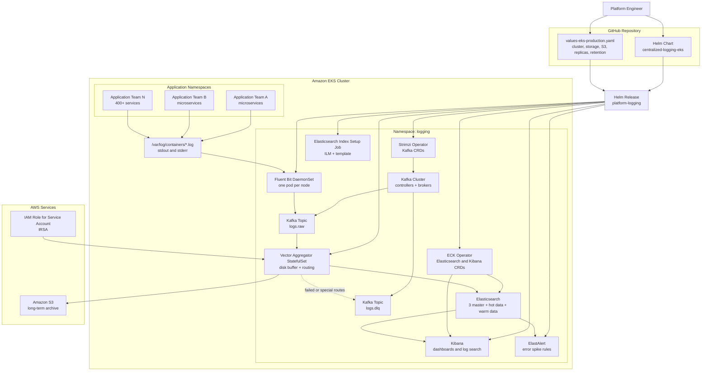

# Centralized Logging Platform for Amazon EKS

A production-ready, Helm-managed centralized logging stack for Amazon EKS.

This chart deploys the complete logging pipeline:

```text
Kubernetes Pods
  -> Fluent Bit DaemonSet
  -> Apache Kafka / Strimzi
  -> Vector Aggregator StatefulSet
  -> Elasticsearch hot + warm data tiers
  -> Amazon S3 archive
  -> Kibana dashboards
  -> ElastAlert alerts
```

Recommended Helm release name:

```bash
platform-logging
```

---

## Table of contents

- [Why this setup was chosen](#why-this-setup-was-chosen)
- [Problems with the previous approach](#problems-with-the-previous-approach)
- [Why the Helm-based solution is better](#why-the-helm-based-solution-is-better)
- [Architecture diagram](#architecture-diagram)
- [Component responsibilities](#component-responsibilities)
- [Repository and Helm chart structure](#repository-and-helm-chart-structure)
- [Prerequisites](#prerequisites)
- [Step-by-step Helm deployment guide](#step-by-step-helm-deployment-guide)
- [Recommended values to review before production](#recommended-values-to-review-before-production)
- [Verification](#verification)
- [Kibana access](#kibana-access)
- [Upgrade guide](#upgrade-guide)
- [Rollback guide](#rollback-guide)
- [Uninstall guide](#uninstall-guide)
- [Application team logging standard](#application-team-logging-standard)
- [Production sizing notes](#production-sizing-notes)
- [Operational best practices](#operational-best-practices)
- [Troubleshooting](#troubleshooting)

---

## Why this setup was chosen

Modern Kubernetes platforms with hundreds of microservices need more than simple pod log viewing. For **400+ microservices** and **10+ application teams**, the logging platform must handle high volume, bursts, search, alerting, team separation, and long-term retention.

This setup was chosen because each component has a focused responsibility:

| Layer | Tool | Why it was selected |
|---|---|---|
| Node-level collection | Fluent Bit | Lightweight log collector that runs as a DaemonSet on every node. It tails Kubernetes container logs with low CPU and memory overhead. |
| Buffer and decoupling | Kafka | Absorbs spikes and protects downstream systems when Elasticsearch or S3 slows down. |
| Processing and routing | Vector | Lightweight, fast, flexible log processing layer with disk buffering and routing to multiple destinations. |
| Hot searchable storage | Elasticsearch | Fast full-text search and filtering for recent logs. |
| Archive storage | Amazon S3 | Low-cost long-term storage for compliance, replay, audits, and historical investigation. |
| Visualization | Kibana | Search UI, dashboards, filters, and troubleshooting experience for engineering teams. |
| Alerting | ElastAlert | Rule-based alerting for error spikes, anomalies, and service-level incidents. |
| Deployment management | Helm | One release, one values file, repeatable installation, versioned upgrades, and easy rollback. |

The result is a platform that is:

- **Lightweight** at the node level
- **Reliable** during traffic spikes
- **Flexible** for multiple application teams
- **Robust** because Kafka and Vector buffers reduce log loss risk
- **Searchable** through Elasticsearch and Kibana
- **Cost-aware** because S3 handles long-term retention
- **Easy to operate** because Helm tracks all resources as one release

---

## Problems with the previous approach

The previous approach used separate Kubernetes manifest files and shell scripts.

That works for a first implementation, but it becomes difficult to manage in a real EKS production environment.

### 1. Too many manual steps

Raw manifests and scripts require engineers to remember the correct order:

```text
Create namespace
Install operators
Create secrets
Apply Kafka
Apply Elasticsearch
Apply Fluent Bit
Apply Vector
Apply Kibana
Apply ElastAlert
Run setup jobs
Verify everything manually
```

This increases the chance of mistakes during production deployment.

### 2. No single release tracking

When resources are applied with `kubectl apply` and shell scripts, Kubernetes resources exist independently.

It becomes harder to answer:

- Which version is currently deployed?
- Which values were used?
- What changed between releases?
- Who upgraded the stack?
- How do we safely roll back?

### 3. Harder upgrades

With raw YAML, every future version upgrade requires manual edits across many files.

For example:

- Kafka version upgrade
- Strimzi API version change
- Elasticsearch version upgrade
- Vector image upgrade
- Fluent Bit configuration update
- Storage size changes
- Retention policy changes

Without Helm, these changes are harder to review and repeat safely.

### 4. Environment drift

Development, staging, and production environments can easily drift apart when each one is deployed manually.

For example:

```text
dev has 3 Kafka brokers
staging has 5 Kafka brokers
prod has 5 Kafka brokers but different storage
```

A values-based Helm chart keeps one reusable template and separates environment-specific configuration into values files.

### 5. Secrets and cloud settings were harder to standardize

For EKS, production S3 access should normally use IAM Roles for Service Accounts, also known as IRSA.

With raw manifests, AWS region, bucket name, role annotation, and secret behavior are spread across files. In this Helm chart, these are configured centrally through `values.yaml`.

### 6. Reusability was limited

The previous bundle was useful, but not as reusable across clusters.

A Helm chart can be installed repeatedly into different clusters using different values files:

```text
values-dev.yaml
values-staging.yaml
values-eks-production.yaml
```

---

## Why the Helm-based solution is better

Helm provides a release-based deployment model.

That means the entire centralized logging platform can be installed, upgraded, rolled back, and uninstalled as one managed release.

### Benefits of this Helm chart

| Benefit | Explanation |
|---|---|
| One command deployment | Deploy the complete logging stack using `helm upgrade --install`. |
| One values file | All required settings are controlled from `values-eks-production.yaml`. |
| Repeatable environments | Use the same chart for dev, staging, and prod with different values files. |
| Easier upgrades | Change image tags, replicas, retention, storage, and versions through values. |
| Rollback support | Use `helm rollback` if a release has issues. |
| Release history | Use `helm history` to see past deployments. |
| Safer reviews | Review changes using `helm diff` or `helm template` before applying. |
| Less duplication | Templates avoid copy-paste across YAML files. |
| Better GitOps fit | Works well with Argo CD, Flux, Jenkins, GitHub Actions, or GitLab CI. |
| Cleaner ownership | The platform team can own the chart while app teams only follow logging standards. |

---

## Architecture diagram

The following Mermaid diagram shows both the **runtime log flow** and the **Helm deployment ownership model**.



---

## Component responsibilities

### Fluent Bit

Fluent Bit runs as a Kubernetes DaemonSet.

Purpose:

- Runs one pod on each node
- Reads container logs from `/var/log/containers/*.log`
- Enriches logs with Kubernetes metadata
- Sends logs to Kafka
- Keeps node-level overhead low

In this platform, Fluent Bit should stay simple. It should collect and forward logs, not perform heavy transformations.

### Kafka

Kafka acts as the durable buffer between log collection and processing.

Purpose:

- Decouples producers from consumers
- Absorbs sudden log spikes
- Protects against downstream slowness
- Enables replay from the raw log topic
- Prevents Elasticsearch from being directly overloaded by all nodes

Main topics:

| Topic | Purpose |
|---|---|
| `logs.raw` | Main raw log stream from Fluent Bit |
| `logs.dlq` | Dead-letter or failed-processing topic |

### Vector Aggregator

Vector is the main processing and routing layer.

Purpose:

- Consumes logs from Kafka
- Normalizes fields
- Adds standard fields such as `cluster`, `namespace`, `service`, `team`, and `environment`
- Routes logs to Elasticsearch and S3
- Uses disk buffers to reduce log loss during downstream issues
- Provides a lightweight alternative to Logstash

Vector is deployed as a StatefulSet because persistent buffers are important for reliability.

### Elasticsearch

Elasticsearch stores recent searchable logs.

Purpose:

- Fast search and filtering
- Support for Kibana dashboards
- Support for ElastAlert rules
- Hot and warm node separation for better cost and performance control

This chart creates separate node sets:

| Node set | Purpose |
|---|---|
| Masters | Dedicated cluster management nodes |
| Hot data | High-speed indexing and recent log search |
| Warm data | Older searchable logs before deletion |

### Amazon S3

S3 stores long-term archived logs.

Purpose:

- Low-cost retention
- Audit and compliance storage
- Replay source for future analysis
- Separation between searchable retention and archive retention

Recommended production authentication method on EKS:

```text
IRSA: IAM Role for Service Account
```

### Kibana

Kibana provides the UI for engineering teams.

Purpose:

- Search logs
- Create dashboards
- Filter by namespace, service, team, environment, and severity
- Debug incidents across microservices

Recommended Kibana data view:

```text
kubernetes-logs-*
```

### ElastAlert

ElastAlert provides rule-based alerting.

Purpose:

- Detect high error rates
- Detect fatal or critical logs
- Notify engineering teams
- Trigger Slack, PagerDuty, email, or other alert targets when configured

The default chart includes a starter high-error-rate rule.

---

## Repository and Helm chart structure

Expected repository layout:

```text
centralized-logging-eks-helm/
├── FILE_LIST.txt
├── centralized-logging-eks-0.1.0.tgz
└── centralized-logging-eks/
    ├── Chart.yaml
    ├── README.md
    ├── values.yaml
    ├── values-eks-production.yaml
    └── templates/
        ├── _helpers.tpl
        ├── namespace.yaml
        ├── priorityclasses.yaml
        ├── s3-secret.yaml
        ├── kafka.yaml
        ├── elasticsearch.yaml
        ├── kibana.yaml
        ├── elasticsearch-index-job.yaml
        ├── fluent-bit.yaml
        ├── vector.yaml
        ├── elastalert.yaml
        ├── pdbs.yaml
        ├── networkpolicies.yaml
        ├── validate-values.yaml
        └── NOTES.txt
```

### Root files

| File or directory | Purpose |
|---|---|
| `FILE_LIST.txt` | Simple generated inventory of files included in the chart package. |
| `centralized-logging-eks-0.1.0.tgz` | Packaged Helm chart artifact. Useful for pushing to a Helm repository or OCI registry. |
| `centralized-logging-eks/` | Main editable Helm chart source directory. |

### Chart files

| File | Purpose |
|---|---|
| `Chart.yaml` | Helm chart metadata: chart name, version, app version, dependencies, keywords, and maintainers. |
| `values.yaml` | Default values for all components. This is the main configuration reference. |
| `values-eks-production.yaml` | Example production override file for Amazon EKS. Edit this before installing into your cluster. |
| `README.md` | GitHub documentation for architecture, deployment, upgrades, and operations. |

### Template files

| Template | Purpose |
|---|---|
| `templates/_helpers.tpl` | Shared Helm helper functions for names, labels, and reusable template logic. |
| `templates/namespace.yaml` | Optional Namespace object when `namespace.create=true`. Most teams still use `--create-namespace`. |
| `templates/priorityclasses.yaml` | Creates priority classes for logging-critical workloads and logging agents. |
| `templates/s3-secret.yaml` | Optionally creates the AWS credentials secret when using secret-based S3 authentication. |
| `templates/kafka.yaml` | Creates Strimzi Kafka NodePools, Kafka cluster, and Kafka topics. |
| `templates/elasticsearch.yaml` | Creates the ECK Elasticsearch cluster with master, hot data, and warm data node sets. |
| `templates/kibana.yaml` | Creates the ECK Kibana resource and optional ingress. |
| `templates/elasticsearch-index-job.yaml` | Creates ILM policy and index template for `kubernetes-logs-*`. |
| `templates/fluent-bit.yaml` | Creates Fluent Bit ServiceAccount, RBAC, ConfigMap, and DaemonSet. |
| `templates/vector.yaml` | Creates Vector ServiceAccount, ConfigMap, headless Service, StatefulSet, PVC, and optional HPA. |
| `templates/elastalert.yaml` | Creates ElastAlert ServiceAccount, ConfigMaps, rules, and Deployment. |
| `templates/pdbs.yaml` | Creates PodDisruptionBudgets for higher availability during node drains and upgrades. |
| `templates/networkpolicies.yaml` | Optional NetworkPolicies when `networkPolicies.enabled=true`. |
| `templates/validate-values.yaml` | Helm validation template to fail early when required values are missing. |
| `templates/NOTES.txt` | Post-install Helm notes shown after installation or upgrade. |

---

## Prerequisites

### Required local tools

```bash
helm version
kubectl version --client
aws --version
```

### Required EKS setup

Your EKS cluster should have:

- Kubernetes cluster already created
- Worker nodes with enough CPU, memory, and disk capacity
- EBS CSI driver installed
- A `gp3` StorageClass, or update the chart values to match your StorageClass
- IAM permissions to create or reference an IRSA role for S3 access
- Network access from the EKS cluster to Amazon S3
- Permission to install CRDs and operators, unless Strimzi and ECK are already installed separately

### Recommended minimum production shape

For the default production values, use a node pool large enough for:

- Kafka brokers
- Elasticsearch hot data nodes
- Elasticsearch warm data nodes
- Vector aggregators
- Kibana
- ElastAlert
- Fluent Bit on every node

A small development cluster should reduce replicas and storage sizes before installing.

---

## Step-by-step Helm deployment guide

This deployment guide uses Helm for installation and release management. No shell scripts are required.

### Step 1: Clone the repository

```bash
git clone <your-repository-url>
cd centralized-logging-eks-helm
```

The chart directory should be:

```bash
centralized-logging-eks/
```

### Step 2: Choose the release name

Recommended release name:

```bash
platform-logging
```

Recommended namespace:

```bash
logging
```

Why this release name is good:

- Short and clear
- Easy to identify in `helm list`
- Produces readable resource names
- Works well for platform-owned infrastructure

Example generated names:

```text
platform-logging-kafka
platform-logging-es
platform-logging-vector
platform-logging-kibana
```

### Step 3: Review and edit the EKS values file

Open:

```bash
centralized-logging-eks/values-eks-production.yaml
```

At minimum, update these values:

```yaml
global:
  clusterName: prod-eks
  environment: prod

aws:
  region: ap-south-1

s3:
  enabled: true
  bucket: your-centralized-logging-bucket
  prefix: centralized-logging
  authMode: irsa
  serviceAccountAnnotations:
    eks.amazonaws.com/role-arn: arn:aws:iam::<account-id>:role/platform-logging-vector-s3
```

Also review storage settings:

```yaml
kafka:
  controllers:
    storageClassName: gp3
    storageSize: 100Gi
  brokers:
    storageClassName: gp3
    storageSize: 500Gi

elasticsearch:
  masters:
    storageClassName: gp3
    storageSize: 50Gi
  hotData:
    storageClassName: gp3
    storageSize: 1Ti
  warmData:
    storageClassName: gp3
    storageSize: 2Ti

vector:
  pvc:
    storageClassName: gp3
    storageSize: 100Gi
```

### Step 4: Choose operator installation mode

This chart can install Strimzi and ECK as Helm dependencies.

#### Option A: Install operators through this chart

Use this for a self-contained deployment:

```yaml
operators:
  strimzi:
    enabled: true
  eck:
    enabled: true
```

#### Option B: Operators already installed by platform team

Use this if your organization manages operators separately:

```yaml
operators:
  strimzi:
    enabled: false
  eck:
    enabled: false
```

The Kafka, Elasticsearch, and Kibana custom resources are still managed by this Helm release.

### Step 5: Update Helm dependencies

From the repository root:

```bash
helm dependency update ./centralized-logging-eks
```

This downloads chart dependencies into:

```text
centralized-logging-eks/charts/
```

### Step 6: Render templates before installing

This is strongly recommended before the first production deployment.

```bash
helm template platform-logging ./centralized-logging-eks \
  --namespace logging \
  -f ./centralized-logging-eks/values-eks-production.yaml \
  > rendered-platform-logging.yaml
```

Review the rendered file:

```bash
less rendered-platform-logging.yaml
```

### Step 7: Run Helm lint

```bash
helm lint ./centralized-logging-eks \
  -f ./centralized-logging-eks/values-eks-production.yaml
```

### Step 8: Install the release

```bash
helm upgrade --install platform-logging ./centralized-logging-eks \
  --namespace logging \
  --create-namespace \
  -f ./centralized-logging-eks/values-eks-production.yaml \
  --wait \
  --timeout 30m
```

### Step 9: Check Helm release status

```bash
helm status platform-logging -n logging
```

List releases:

```bash
helm list -n logging
```

View values used by the release:

```bash
helm get values platform-logging -n logging
```

View all computed values:

```bash
helm get values platform-logging -n logging --all
```

View rendered manifests from the release:

```bash
helm get manifest platform-logging -n logging
```

---

## Recommended values to review before production

### Global settings

```yaml
global:
  clusterName: prod-eks
  environment: prod
```

These values are added to log events and help distinguish clusters and environments.

### S3 archive

```yaml
s3:
  enabled: true
  bucket: your-centralized-logging-bucket
  prefix: centralized-logging
  authMode: irsa
```

Recommended for EKS:

```yaml
s3:
  authMode: irsa
```

Use secret-based authentication only when IRSA is not available.

### Kafka sizing

```yaml
kafka:
  controllers:
    replicas: 3
  brokers:
    replicas: 5
  topics:
    raw:
      partitions: 96
      replicas: 3
```

For high-volume logging, Kafka partition count is important because it controls parallelism for Vector consumers.

### Vector sizing

```yaml
vector:
  replicas: 6
  hpa:
    enabled: true
    minReplicas: 6
    maxReplicas: 20
```

Increase Vector replicas if Kafka consumer lag grows.

### Elasticsearch sizing

```yaml
elasticsearch:
  masters:
    count: 3
  hotData:
    count: 6
  warmData:
    count: 3
```

Increase hot data nodes if indexing latency or query latency increases.

### Retention

```yaml
elasticsearch:
  ilm:
    hotRolloverMaxAge: 1d
    warmMinAge: 7d
    deleteMinAge: 30d
```

This keeps recent logs searchable and older logs in S3 archive.

---

## Verification

After installation, check the Helm release:

```bash
helm status platform-logging -n logging
```

Optional Kubernetes checks:

```bash
kubectl get pods -n logging -o wide
kubectl get kafka -n logging
kubectl get kafkatopic -n logging
kubectl get elasticsearch -n logging
kubectl get kibana -n logging
```

Expected main workloads:

```text
Fluent Bit DaemonSet
Kafka controllers and brokers
Vector Aggregator StatefulSet
Elasticsearch master, hot data, and warm data nodes
Kibana
ElastAlert
Elasticsearch index setup Job
```

---

## Kibana access

Port-forward Kibana:

```bash
kubectl port-forward -n logging svc/platform-logging-kibana-kb-http 5601:5601
```

Open:

```text
https://localhost:5601
```

Get the Elastic user password:

```bash
kubectl get secret platform-logging-es-es-elastic-user \
  -n logging \
  -o go-template='{{.data.elastic | base64decode}}{{"\n"}}'
```

Username:

```text
elastic
```

Create a Kibana data view:

```text
kubernetes-logs-*
```

Recommended fields for filtering:

```text
cluster
environment
namespace
service
team
severity
pod
container
trace_id
span_id
```

---

## Upgrade guide

### Step 1: Change values

Edit:

```bash
centralized-logging-eks/values-eks-production.yaml
```

Example changes:

```yaml
vector:
  replicas: 8

elasticsearch:
  ilm:
    deleteMinAge: 45d
```

### Step 2: Preview changes

```bash
helm template platform-logging ./centralized-logging-eks \
  --namespace logging \
  -f ./centralized-logging-eks/values-eks-production.yaml \
  > rendered-upgrade.yaml
```

If your team uses the Helm diff plugin:

```bash
helm diff upgrade platform-logging ./centralized-logging-eks \
  --namespace logging \
  -f ./centralized-logging-eks/values-eks-production.yaml
```

### Step 3: Upgrade

```bash
helm upgrade platform-logging ./centralized-logging-eks \
  --namespace logging \
  -f ./centralized-logging-eks/values-eks-production.yaml \
  --wait \
  --timeout 30m
```

### Step 4: Review release history

```bash
helm history platform-logging -n logging
```

---

## Rollback guide

If an upgrade causes issues, check the release history:

```bash
helm history platform-logging -n logging
```

Rollback to a previous revision:

```bash
helm rollback platform-logging <REVISION> -n logging --wait --timeout 30m
```

Example:

```bash
helm rollback platform-logging 2 -n logging --wait --timeout 30m
```

---

## Uninstall guide

Uninstall the Helm release:

```bash
helm uninstall platform-logging -n logging
```

Important:

- PersistentVolumeClaims may remain depending on the chart values and StorageClass reclaim policy.
- S3 archived logs are not deleted by Helm.
- CRDs may remain if installed by operator charts.
- Elasticsearch data should be backed up before destructive changes.

Check remaining PVCs:

```bash
kubectl get pvc -n logging
```

---

## Application team logging standard

For best results, application teams should log structured JSON to stdout or stderr.

Example:

```json
{
  "timestamp": "2026-05-13T10:00:00Z",
  "level": "info",
  "message": "order created",
  "trace_id": "abc123",
  "span_id": "def456",
  "service": "order-service",
  "team": "payments",
  "environment": "prod"
}
```

Recommended Kubernetes labels:

```yaml
metadata:
  labels:
    app.kubernetes.io/name: order-service
    app.kubernetes.io/team: payments
    app.kubernetes.io/part-of: payments-platform
    environment: prod
```

Recommended standard fields:

| Field | Example | Purpose |
|---|---|---|
| `timestamp` | `2026-05-13T10:00:00Z` | Event time |
| `level` | `info`, `warn`, `error` | Severity |
| `message` | `order created` | Human-readable message |
| `trace_id` | `abc123` | Distributed tracing correlation |
| `span_id` | `def456` | Span correlation |
| `service` | `order-service` | Service name |
| `team` | `payments` | Owning team |
| `environment` | `prod` | Environment |

To exclude a pod from Fluent Bit collection:

```yaml
metadata:
  annotations:
    fluentbit.io/exclude: "true"
```

---

## Production sizing notes

The default values are production-style starter values for a larger EKS environment, not a universal final sizing.

### Default starter sizing

| Component | Default |
|---|---:|
| Kafka controllers | 3 |
| Kafka brokers | 5 |
| Kafka topic partitions | 96 |
| Elasticsearch masters | 3 |
| Elasticsearch hot data nodes | 6 |
| Elasticsearch warm data nodes | 3 |
| Vector aggregators | 6 |
| Kibana replicas | 2 |
| ElastAlert replicas | 2 |
| Fluent Bit | 1 pod per node |

### Estimate daily log volume

Use this formula:

```text
daily_log_gb =
  services
  × average_pods_per_service
  × average_logs_per_pod_per_second
  × average_log_size_bytes
  × 86400
  / 1024^3
```

Example:

```text
400 services × 2 pods × 2 logs/sec × 800 bytes × 86400 / 1024^3
≈ 103 GB/day raw logs
```

Elasticsearch storage is usually larger than raw log size because of indexing, mappings, replicas, and metadata.

### When to scale Kafka

Scale Kafka when:

- Broker disk usage is high
- Broker CPU is consistently high
- Produce latency increases
- Under-replicated partitions appear
- Vector cannot consume fast enough even after scaling Vector

### When to scale Vector

Scale Vector when:

- Kafka consumer lag grows
- Vector CPU remains high
- Vector disk buffers grow continuously
- Elasticsearch or S3 retries increase
- End-to-end log delivery latency increases

### When to scale Elasticsearch

Scale Elasticsearch when:

- Indexing latency increases
- JVM heap pressure is high
- Query latency is high
- Hot nodes are disk constrained
- Shards are too large
- Cluster health becomes yellow or red

---

## Operational best practices

### 1. Keep Fluent Bit lightweight

Do not add heavy parsing and enrichment at Fluent Bit unless necessary.

Recommended split:

```text
Fluent Bit = collect and forward
Vector = normalize and route
Elasticsearch = search
S3 = archive
```

### 2. Use IRSA for S3

For EKS production, prefer:

```yaml
s3:
  authMode: irsa
```

Avoid long-lived AWS access keys when possible.

### 3. Keep Elasticsearch retention realistic

For high-volume microservices, do not keep too much data in Elasticsearch.

Recommended pattern:

```text
Elasticsearch = recent searchable logs
S3 = long-term archive
```

### 4. Standardize team labels

Application teams should provide consistent labels:

```yaml
app.kubernetes.io/name
app.kubernetes.io/team
environment
```

This enables better routing, dashboards, ownership, and alerting.

### 5. Monitor the logging platform itself

You should monitor:

- Fluent Bit error and retry counts
- Kafka broker health
- Kafka topic partition health
- Kafka consumer lag
- Vector buffer size
- Vector output retries
- Elasticsearch cluster health
- Elasticsearch indexing latency
- Elasticsearch JVM heap
- Kibana availability
- ElastAlert execution errors
- S3 delivery failures

### 6. Use separate node groups where possible

For production EKS, consider separate managed node groups for:

- Kafka
- Elasticsearch
- General workloads
- Logging/observability

This prevents noisy application workloads from affecting logging reliability.

---

## Troubleshooting

### Helm install fails

Check rendered output:

```bash
helm template platform-logging ./centralized-logging-eks \
  --namespace logging \
  -f ./centralized-logging-eks/values-eks-production.yaml
```

Check release status:

```bash
helm status platform-logging -n logging
```

### Kafka resources are not created

Check whether Strimzi is installed:

```bash
kubectl get pods -n logging | grep strimzi
kubectl get crd | grep kafka.strimzi.io
```

If Strimzi is managed separately, set:

```yaml
operators:
  strimzi:
    enabled: false
```

### Elasticsearch resources are not created

Check whether ECK is installed:

```bash
kubectl get pods -n elastic-system
kubectl get crd | grep elasticsearch.k8s.elastic.co
```

If ECK is managed separately, set:

```yaml
operators:
  eck:
    enabled: false
```

### No logs appear in Kibana

Check the flow step by step:

```bash
kubectl logs -n logging daemonset/platform-logging-fluent-bit --tail=100
kubectl get kafkatopic -n logging
kubectl logs -n logging statefulset/platform-logging-vector --tail=100
kubectl get elasticsearch -n logging
```

Then check Kibana data view:

```text
kubernetes-logs-*
```

### S3 archive is not receiving logs

Check:

```yaml
s3:
  enabled: true
  bucket: your-bucket
  authMode: irsa
```

Verify IRSA annotation:

```yaml
s3:
  serviceAccountAnnotations:
    eks.amazonaws.com/role-arn: arn:aws:iam::<account-id>:role/platform-logging-vector-s3
```

Check Vector logs:

```bash
kubectl logs -n logging statefulset/platform-logging-vector --tail=200
```

### Elasticsearch is under pressure

Review:

- Hot data node CPU
- JVM heap pressure
- Disk usage
- Indexing latency
- Shard count
- ILM rollover size
- Retention days

Then consider:

```yaml
elasticsearch:
  hotData:
    count: 8
  ilm:
    deleteMinAge: 14d
```

### Kafka consumer lag is increasing

Consider increasing Vector replicas:

```yaml
vector:
  replicas: 8
  hpa:
    maxReplicas: 30
```

Also review Kafka topic partitions:

```yaml
kafka:
  topics:
    raw:
      partitions: 192
```

Partition increases should be planned carefully because they affect ordering and consumer behavior.

---

## Recommended Git workflow

Use separate values files per environment:

```text
values-dev.yaml
values-staging.yaml
values-eks-production.yaml
```

Recommended deployment flow:

```text
Pull request
  -> helm lint
  -> helm template
  -> review rendered diff
  -> merge
  -> deploy through CI/CD or GitOps
```

Example CI validation commands:

```bash
helm dependency update ./centralized-logging-eks

helm lint ./centralized-logging-eks \
  -f ./centralized-logging-eks/values-eks-production.yaml

helm template platform-logging ./centralized-logging-eks \
  --namespace logging \
  -f ./centralized-logging-eks/values-eks-production.yaml
```

---

## Summary

This Helm chart turns the centralized logging system into a repeatable, maintainable, production-ready EKS platform component.

It improves the previous manifest/script-based approach by providing:

- One Helm release
- One values file
- Repeatable deployments
- Easier upgrades
- Rollback support
- Clear ownership
- Better GitOps compatibility
- Better long-term maintainability

Final recommended architecture:

```text
Fluent Bit -> Kafka -> Vector -> Elasticsearch + S3 -> Kibana + ElastAlert
```

Final recommended Helm release name:

```bash
platform-logging
```
